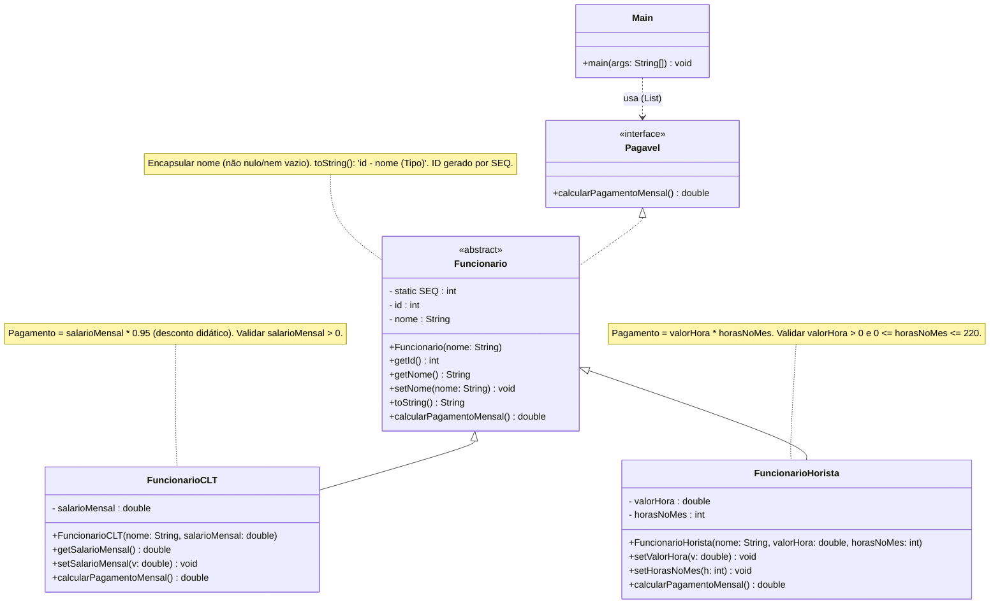
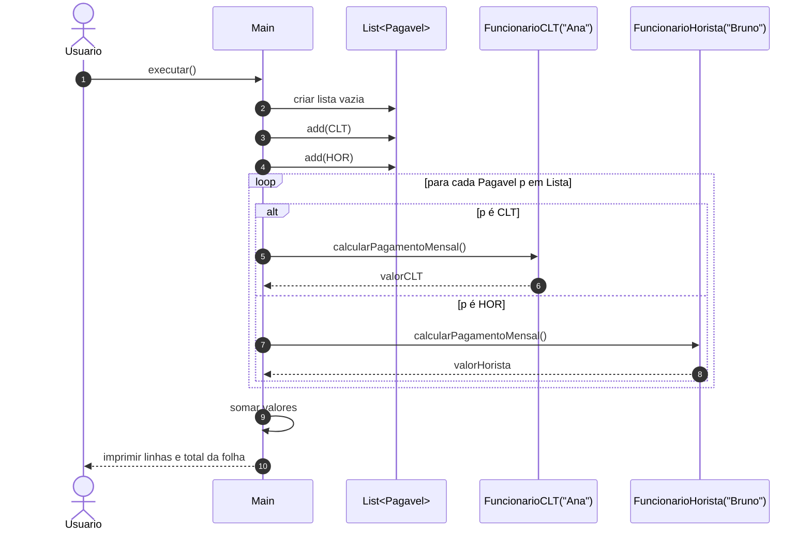

# 💻 Tarefa — Folha de Pagamento (2,0 pts)

## 🎯 Objetivo

Praticar os fundamentos de **POO em Java** a partir de um **modelo UML**:

* Classe/Objeto • Encapsulamento • Herança
* Interface • Polimorfismo • Override

Implemente o código **a partir dos diagramas** abaixo.

---

## 🧩 Descrição

Criar um mini sistema de **folha de pagamento** com dois tipos de funcionários:

* **CLT** (salário fixo com desconto didático)
* **Horista** (valor hora × horas no mês)

---

## 📦 Diagrama de **Classes** (Mermaid)

---

## 🔄 Diagrama de **Sequência** — Polimorfismo em ação

---

## ✅ Requisitos de Implementação (a partir do UML)

1. **Interface `Pagavel`**

   * Método: `double calcularPagamentoMensal()`.

2. **Classe abstrata `Funcionario`**

   * Atributos: `id` (gerado por `SEQ`), `nome`.
   * Encapsulamento: `get/set` com **validação** de `nome`.
   * `toString()` no formato: `id - nome (Tipo)`.
   * Implementa `Pagavel`.

3. **`FuncionarioCLT`**

   * Atributo: `salarioMensal` (> 0).
   * Implementação: `calcularPagamentoMensal() = salarioMensal * 0.95`.

4. **`FuncionarioHorista`**

   * Atributos: `valorHora` (> 0), `horasNoMes` (0..220).
   * Implementação: `calcularPagamentoMensal() = valorHora * horasNoMes`.

5. **`Main`**

   * Criar `List<Pagavel>` com pelo menos um CLT e um Horista.
   * Iterar chamando `calcularPagamentoMensal()` (polimorfismo).
   * Imprimir a linha de cada funcionário e o **total da folha**.

---

## 📝 Critérios de Avaliação (2,0 pts)

| Critério                                          | Peso    |
| ------------------------------------------------- | ------- |
| Encapsulamento + validações                       | 0,4     |
| Herança (abstrata + 2 concretas)                  | 0,4     |
| Interface + Polimorfismo no `Main`                | 0,4     |
| Override (`toString` e `calcularPagamentoMensal`) | 0,4     |
| Execução correta e clareza de saídas              | 0,4     |
| **Total**                                         | **2,0** |

---

## 💡 Dicas

* Não precisa de `Scanner`; valores fixos no `Main` são suficientes.
* Comente no código onde aparecem **encapsulamento**, **herança**, **interface**, **polimorfismo** e **override**.
* Siga fielmente o UML para manter a coerência do design.
