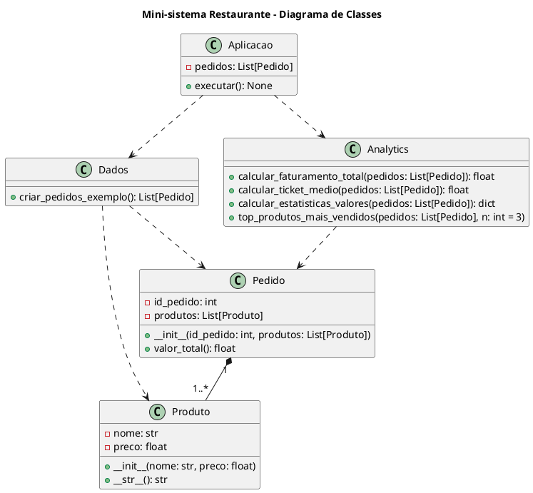
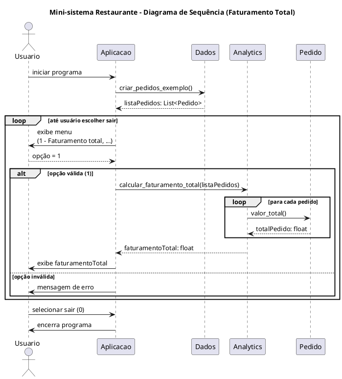

# Mini-projeto – Python (Júnior)

**Título:** Mini-sistema de análise de pedidos de um restaurante
**Tempo sugerido:** 1h30
**Tecnologias:** Python 3, módulos, classes, tratamento de exceções, `numpy`

---

## 1. Contexto

Você foi contratado(a) para criar um pequeno sistema em Python que ajude o **Restaurante Bom Prato** a analisar os pedidos feitos em um dia.

O restaurante quer saber:

* Quanto faturou no dia.
* Qual o valor médio gasto por pedido (ticket médio).
* Algumas estatísticas simples dos valores dos pedidos (mínimo, máximo, média).
* Quais produtos aparecem com mais frequência nos pedidos (top N produtos).

O sistema deve ser **modular**, usar **programação orientada a objetos**, **tratamento de exceções** (`try/except`) e a biblioteca **`numpy`** para alguns cálculos numéricos.

> Você terá acesso apenas ao VSCode e ao interpretador Python (sem internet).

---

## 2. Ambiente de desenvolvimento

* Linguagem: **Python 3**
* Editor: **VSCode**
* Biblioteca externa permitida: **`numpy`** (considerar que já está instalada)
* Não usar internet ou outras bibliotecas externas além de `numpy`.

---

## 3. Modelo de Domínio (UML de Classes)

O sistema deve seguir aproximadamente o modelo conceitual abaixo.

### 3.1. Classes principais

* **Produto**

  * Atributos:

    * `nome: str`
    * `preco: float`
  * Métodos:

    * Construtor (`__init__`)
    * Representação (`__str__` ou `__repr__`)

* **Pedido**

  * Atributos:

    * `id_pedido: int`
    * `produtos: List[Produto]` (lista de produtos)
  * Métodos:

    * `valor_total() -> float`: soma os preços dos produtos do pedido.

* **Dados** (responsável por criar pedidos de exemplo)

  * Métodos:

    * `criar_pedidos_exemplo() -> List[Pedido]`

* **Analytics** (responsável por cálculos e estatísticas)

  * Métodos:

    * `calcular_faturamento_total(pedidos: List[Pedido]) -> float`
    * `calcular_ticket_medio(pedidos: List[Pedido]) -> float`
    * `calcular_estatisticas_valores(pedidos: List[Pedido]) -> dict`
    * `top_produtos_mais_vendidos(pedidos: List[Pedido], n: int = 3)`

* **Aplicacao** (equivalente ao `main.py` – menu e interação com o usuário)

  * Atributos:

    * `pedidos: List[Pedido]`
  * Métodos:

    * `executar() -> None` (loop principal do menu)

### 3.2. Relacionamentos (descrição)

* Um **Pedido** é composto por **um ou mais Produtos**.
* O módulo/classe **Dados** depende de `Produto` e `Pedido`.
* O módulo/classe **Analytics** depende de `Pedido`.
* A **Aplicacao** usa `Dados` para carregar pedidos e `Analytics` para calcular os resultados.

### 3.3. PlantUML – Diagrama de Classes (opcional para você gerar imagem)



---

## 4. Requisitos Funcionais

1. **Modelagem dos dados (OO)**

   * Implementar as classes `Produto` e `Pedido` conforme o modelo UML.
   * `Pedido.valor_total()` deve retornar a soma dos preços de seus produtos.

2. **Criação de dados de exemplo**

   * Implementar uma função `criar_pedidos_exemplo()` que devolva uma lista de **3 a 6 pedidos**.
   * Alguns produtos devem se repetir em pedidos diferentes (para permitir análise de “mais vendidos”).
   * Essa função pode ficar em um módulo, por exemplo `dados.py`.

3. **Módulo de análise com `numpy`**

   * Em um módulo (por exemplo, `analytics.py`), implementar funções que recebam a lista de pedidos e usem `numpy`:

     * `calcular_faturamento_total(pedidos) -> float`

       * Soma o `valor_total()` de todos os pedidos.
     * `calcular_ticket_medio(pedidos) -> float`

       * Faturamento total dividido pelo número de pedidos.
     * `calcular_estatisticas_valores(pedidos) -> dict`

       * Usar `numpy` para calcular pelo menos:

         * média (`np.mean`)
         * mínimo (`np.min`)
         * máximo (`np.max`)
       * Retornar um dicionário com essas estatísticas.
     * `top_produtos_mais_vendidos(pedidos, n=3)`

       * Retornar os **N produtos mais frequentes**, por exemplo uma lista de tuplas `(nome, quantidade)`.

4. **Interface de linha de comando com tratamento de erros**

   * Em `main.py` (ou em uma classe `Aplicacao`), criar um **menu de texto**:

     ```text
     === Menu Restaurante Bom Prato ===
     1 - Mostrar faturamento total do dia
     2 - Mostrar ticket médio dos pedidos
     3 - Mostrar estatísticas (mínimo, máximo, média dos valores dos pedidos)
     4 - Mostrar top 3 produtos mais vendidos
     0 - Sair
     Escolha uma opção: 
     ```

   * Ler a opção com `input()`.
   * Usar `try/except` para:

     * Tratar erros de conversão para inteiro (`ValueError`).
     * Tratar possíveis divisões por zero (por exemplo, se não houver pedidos).
   * Se a opção for inválida, exibir mensagem amigável e pedir novamente, sem encerrar o programa à força.

5. **Organização em módulos**

   * Utilizar **pelo menos 3 arquivos `.py`**, por exemplo:

     * `models.py` – classes `Produto` e `Pedido`
     * `dados.py` – função `criar_pedidos_exemplo`
     * `analytics.py` – funções de análise com `numpy`
     * `main.py` – lógica de menu e interação com o usuário
   * Usar imports apropriados entre os módulos.

---

## 5. Fluxo Principal (Diagrama de Sequência)

Abaixo está um fluxo típico da opção “Mostrar faturamento total do dia”.

### 5.1. Descrição

1. O **Usuário** inicia o programa.
2. A **Aplicacao** chama `Dados.criar_pedidos_exemplo()` para carregar a lista de pedidos.
3. A Aplicacao entra em um loop exibindo o menu.
4. O Usuário escolhe a opção `1` (faturamento total).
5. A Aplicacao chama `Analytics.calcular_faturamento_total(pedidos)`.
6. `Analytics` percorre a lista de pedidos e, para cada `Pedido`, chama `pedido.valor_total()`.
7. `Analytics` devolve o faturamento total.
8. A Aplicacao mostra o resultado para o Usuário.
9. O loop continua até o Usuário escolher a opção `0` (sair).

### 5.2. PlantUML – Diagrama de Sequência (opcional)



---

## 6. Requisitos Não Funcionais

* Código deve compilar/rodar sem erros em Python 3.
* Usar `import numpy as np` para as operações numéricas.
* Evitar colocar “tudo” dentro de um único arquivo; respeitar a divisão em módulos.
* É desejável (mas não obrigatório):

  * Uso de **type hints**.
  * Função `main()` com `if __name__ == "__main__": main()` em `main.py`.
  * Comentários ou docstrings curtos explicando as funções.

---

## 7. O que será avaliado

* Organização do código em módulos.
* Uso correto de classes, objetos e métodos.
* Capacidade de trabalhar com uma biblioteca externa simples (`numpy`).
* Tratamento básico de erros (`try/except`).
* Clareza do código (nomes de variáveis, funções, etc.) e aderência ao problema proposto.
